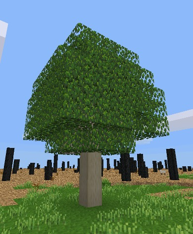

# Maple
Maple Tree for Minetest by ExeterDad

This mod adds a maple tree to the minetest game. Originally written for the Hometown server (http://hometownserver.com/) by ExeterDad (https://forum.minetest.net/memberlist.php?mode=viewprofile&u=10544).

## The tree



## Bonemeal

The mod now registers itself with the bonemeal API (optional). Saplings should be recognized automatically, and grow faster with bonemeal.

## Technic chainsaw

Add this to technic/technic/tools/chainsaw.lua to enable support for maple trees for the chainsaw tool:

```
-- Support maple
if minetest.get_modpath("maple") then
	timber_nodenames["maple:maple_tree"]         = true
	if chainsaw_leaves then
		timber_nodenames["maple:maple_leaves"] = true
	end
end
```

## Stairs, slabs and doors

Maple tries to register fancy wooden shapes for maple wood with stairs, moreblocks, and doors.

## Drawers

If storage drawers mod is available, maple registers the corresponding assortment of drawers.

## Arcs

If pkarcs (simple arcs) mod is found, maple arcs are registered.

