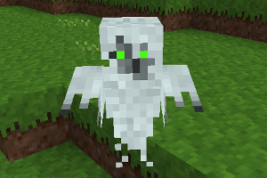

### Mobs Ghost Redo
  
**_Adds ghosts._**

**NOTE:** This is Blockmen's [CME Ghost][8] mob ported to Mobs Redo, and tweaked.

**Version:** 0.7.0  
**Source code's license:** [EUPL v1.2][1] or later.  
**Media (Textures, Models, Sounds) license:** [CC-BY-SA 4.0 International][2].

**Dependencies:** default, bones (found in [Minetest Game][3]), mobs ([Mobs Redo][4])  
**Supported:** [mobs_humans][5], [mobs_others][6], [moreores][7]

__Advanced options:__
Settings -> All Settings -> Mods -> mobs_ghost_redo

### Installation

Unzip the archive, rename the folder to mobs_ghost_redo and place it in  
../minetest/mods/

If you only want this to be used in a single world, place it in  
../minetest/worlds/WORLD_NAME/worldmods/

GNU+Linux - If you use a system-wide installation place it in  
~/.minetest/mods/

For further information or help see:  
https://wiki.minetest.net/Help:Installing_Mods

[1]: https://eur-lex.europa.eu/legal-content/EN/TXT/?uri=CELEX:32017D0863
[2]: https://creativecommons.org/licenses/by-sa/4.0/
[3]: https://github.com/minetest/minetest_game
[4]: https://forum.minetest.net/viewtopic.php?t=9917
[5]: https://forum.minetest.net/viewtopic.php?t=20183
[6]: https://forum.minetest.net/viewtopic.php?t=19921
[7]: https://forum.minetest.net/viewtopic.php?t=549
[8]: https://forum.minetest.net/viewtopic.php?t=8638
