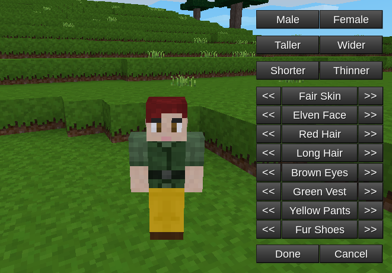

# Character Creator

This mod is attributed to the Voxelands project.
It allows you to customize your skin.

To change your skin, use either the chat commmand `/character_creator`
or a dedicated button in one of the supported inventory mods (see below).

### Requirements

 * Minetest 5.0.0 or newer

### Supported mods

 * multiskin
 * 3d_armor
 * sfinv (Minetest Game)
 * unified_inventory
 * sfinv_buttons
 * inventory_plus

### License

Code: MIT

Textures: CC BY-SA 3.0

See also: [license.txt](license.txt)

### Credits

Voxelands creators:

 * sdzen
 * darkrose