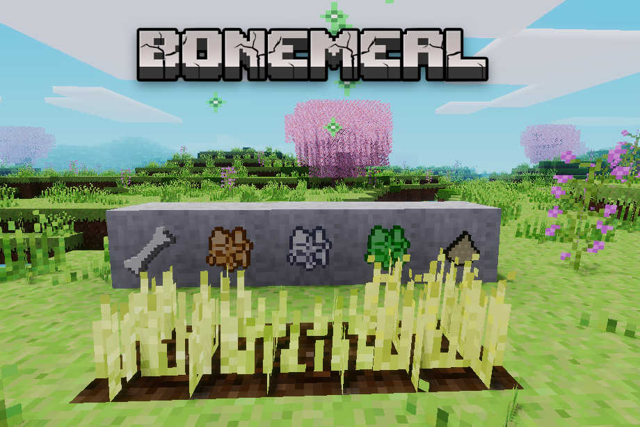

minetest mod Bonemeal
=====================

FARM mod that helps and featured the farming to quickly grow samplings, crops, grass, etc

Information
-----------

Bonemeal is crushed from bones found in dirt or by using player bones, Mulch is
made from a tree trunk surrounded by leaves and Fertiliser is a mix of both,
each of which can be used to quickly grow saplings, crops and grass/decoration,
papyrus on top of dirt and cactus on sand.

Support for ethereal saplings/crops, farming redo crops and moretrees saplings are included.



## Technical info

This mod is named `bonemeal` and must be installed with such name.

This mod adds four new items into the game, bones which can be dug from normal
dirt which can be cooked into bonemeal, mulch which is is crafted using a tree
and 8x leaves, and fertiliser which is a mixture of them both.

Each item can be used on saplings and crops for a chance to grow them quicker
as well as dirt which will generate random grass, flowers or whichever
decoration is registered.

Mulch has a strength of 1, Bonemeal 2 and Fertiliser 3. This means the stronger
the item, the more chance of growing saplings in low light, making crops sprout
quicker or simply decorate a larger area with grass and flowers.

#### Dependencies

Dependencies: default

Optional Dependencies: farming, ethereal, moretrees, lucky_block, moretrees, flowers, dye, ferns, dryplants, df_trees, df_farming, df_primordial_items, everness

Lucky Blocks: 6

#### API

The [`api.txt`](api.txt) document shows how to add your own saplings,
crops and grasses to the list by using one of the 3 commands included and
the [`mod.lua`](mod.lua) file gives you many examples by using some of the
popular mods available.

https://forum.minetest.net/viewtopic.php?f=9&t=16446

#### Nodes

| Node name               | description  | notes |
| ----------------------- | ------------ | --------------------------------------------------- |
| bonemeal:mulch          | Mulch        | fertilizer to make grow plants and seeds faster     |
| bonemeal:bonemeal       | Bone Meal    | 2 x fertilizer to make grow plants and seeds faster |
| bonemeal:fertiliser     | Fertiliser   | 3 x fertilizer to make grow plants and seeds faster |
| bonemeal:bone           | Bone         | cook to made fertilizers, found into dirt rarelly   |
| bone:bone               | Player bones | cook to made fertilizers, found into dirt rarelly   |
| bonemeal:gelatin_powder | Gelatin Powder | made from bones                             |

#### Crafts

* bonemeal:gelatin_powder 4

```
	{"group:bone", "group:bone", "group:bone"},
	{"bucket:bucket_water", "bucket:bucket_water", "bucket:bucket_water"},
	{"bucket:bucket_water", "default:torch", "bucket:bucket_water"}
```

* bonemeal:bonemeal 2

```
	{{"group:bone"}}
```

* bonemeal:bonemeal 4

```
	{{"bones:bones"}}
```

* bonemeal:bonemeal 2

```
	{{"default:coral_skeleton"}}
```

* bonemeal:mulch 4

```
	{"group:tree", "group:leaves", "group:leaves"},
	{"group:leaves", "group:leaves", "group:leaves"},
	{"group:leaves", "group:leaves", "group:leaves"}
```

* bonemeal:mulch

```
	{"group:seed", "group:seed", "group:seed"},
	{"group:seed", "group:seed", "group:seed"},
	{"group:seed", "group:seed", "group:seed"}
```

* fertiliser 2

```
	{{"bonemeal:bonemeal", "bonemeal:mulch"}}
```

## Changelog

#### Version 0.1

* Initial release

#### Version 0.2

* Added global `on_use` function for bonemeal growth

#### Version 0.3

* Added strength to `on_use` global for new items (mulch and fertiliser)

#### Version 0.4

* Added `Intllib` support and `fr.txt` file for French translation.

#### Version 0.5

* Added support for default bush and acacia bush saplings

#### Version 0.6

* Using newer functions. This means Minetest 0.4.16 and above needed to run

#### Version 0.7

* Can be used on papyrus and cactus now
* Added coral recipe
* API addition

#### Version 0.8

* Added support for farming redo's new garlic
* Added pepper and onion crops

#### Version 0.9

* Added support for farming redo's pea and beetroot crops
* Checks for `place_param`

#### Version 1.0

* `add_deco()` now adds to existing item list while `set_deco()` replaces item
  list (thanks `h-v-smacker`)

#### Version 1.1

* Added `{can_bonemeal=1}` group for special nodes

#### Version 1.2

* Added support for Minetest 5.0 cactus seedling, blueberry bush sapling and
  emergent jungle tree saplings, additional flowers and pine bush sapling

#### Version 1.3

* Added ability to craft dye from mulch, bonemeal and fertiliser (thanks
  `orbea`)

#### Version 1.4

* Added support for fern saplings from `plantlife` mod (thanks `nixnoxus`)

#### Version 1.5

* Added support for farming redo's asparagus, eggplant, spinach

#### Version 1.6

* Added helper function for position and protection check
* Added ginger support
* Added moretrees poplar sapling

#### Version 1.7

* Added farming redo's barley, hemp, rye, oat, mint, sunflower, rice seeds
* Added Everness saplings
* Update readme (thanks mckaygerhard)
* Recipe changes, player bones craft into 2x bones, bones must be cooked to
  give bonemeal
* Added bushes_classic support

## LICENSE

Licence: Code is MIT, Media is CC0

(c) Tenplus1
