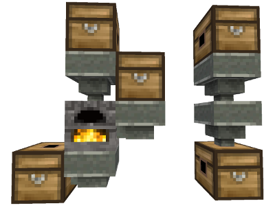

## Hoppers, chutes and sorters

Based on jordan4ibanez's original hoppers mod, optimized by TenPlus1 and FaceDeer, with chutes and sorters by FaceDeer

Lucky Blocks: 2

Change log: [CHANGELOG.md](CHANGELOG.md)

### Functionality description

#### Hopper node

Hoppers are nodes that can transfer items to and from the inventories of adjacent nodes. The transfer direction depends on the orientation of the hopper.

The wide end of a hopper is its "input" end, if there is a compatible container (e.g. a chest), one item per second is taken into its own internal inventory. The hopper will also draw in dropped items.

The narrow end of the hopper is its "output" end. It can be either straight or 90° bent, relative to the input. It will attempt to inject items into a compatible container connected to it. On failure, the item is either held back in the hopper inventory or ejected, depending on its configuration.

#### Chute node

The "chute" node acts as a pipe for items injected by a hopper or sorter. Use a screwdriver tool to achieve the desired rotation.

#### Sorter node

Item stacks placed into the "filter" grid of the sorter node inventory define how to distribute the incoming items into the two outputs.

 * Matching items are sent into the direction of the large arrow (`V`).
 * Other items are sent to the 90° side output.

Special case: The "filter all" option will cause the sorter to attempt to send *all* items in the direction of the large arrow. On failure, they're sent in the direction of the smaller arrow. Use-cases:

 * Protection against overflowing containers
 * Protection against unaccepted items in the destination slot(s), such as the furnace fuel slot

#### Built-in mod compatibility

The following nodes are supported out-of-the-box. "above"/"below"/"side" describe the location of the hopper.

 * `default:furnace`
     * Above: routed to the input slot
     * Below: routed to the output slots
     * Sides: routed to the fuel slot
 * `default:chest(_locked)`, `protector:chest`
     * All sides: routed to the main slot
 * `wine:wine_barrel`
     * Above: routed to the destination slots
     * Below: routed to the source slot
     * Sides: routed to the source slot

### Advanced settings

This mod has several configurable settings. See settings menu or [settingtypes.txt](settingtypes.txt) for details.

* Hopper texture size: 16x16 pixels (default) or 32x32 pixels
* Single craftable item: output is straight or rotated by 90° to the side based on how you place it (default). When disabled, straight and bent hoppers must be crafted separately.
* Eject items button: option to remove the "eject items" button from hoppers

